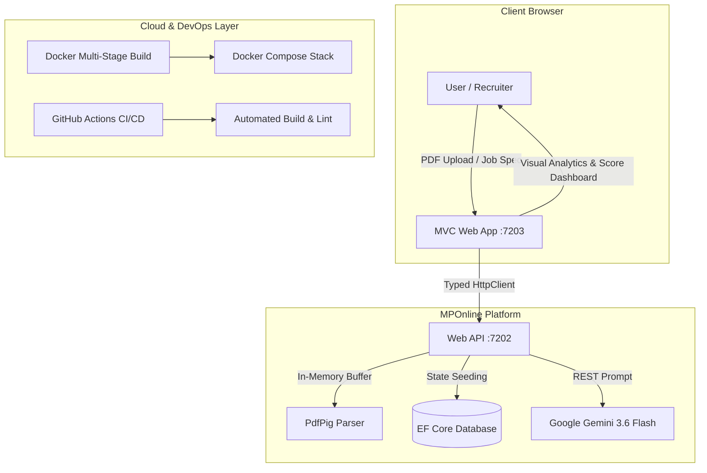

# MPOnline ResumeAnalyser - Enterprise ATS & Career Intelligence


**MPOnline ResumeAnalyser** is an enterprise-grade, cloud-ready resume parsing and Applicant Tracking System (ATS) intelligence platform. Built on decoupled **ASP.NET Core Web API** and **ASP.NET Core MVC**, it combines in-memory document parsing via `PdfPig` with Google Gemini 3.6 Flash zero-shot prompt engineering to deliver deterministic, bias-free ATS scoring and job fit analysis.

---

## 🚀 Key Highlights & Capabilities

* **Decoupled Architecture:** Clean separation of concerns with a dedicated RESTful Web API and an interactive ASP.NET Core MVC frontend communicating via typed HTTP clients.
* **AI Substantiation Engine:** Combats keyword stuffing by cross-verifying listed technical proficiencies against quantitative metrics and project descriptions.
* **Explainability Node (Responsible AI):** Provides a transparent rationale for scoring deductions, removing the "black box" stigma of legacy ATS scanners.
* **Deterministic JSON Schema:** Uses strict prompt constraints with JSON parsing to eliminate hallucinations and schema drifts.
* **Memory-Safe PDF Parsing:** Leverages `PdfPig` with `MemoryStream` execution, ensuring zero unencrypted file remnants on server disks.
* **Report Export Capabilities:** Built-in PDF print generation and client-side JSON export for candidates and recruiters.

---

## 🏛️ System Architecture



---

## ☁️ Cloud & DevOps Integration Guide

This application is designed from the ground up for modern Cloud and DevOps ecosystems:

### 1. Docker & Container Orchestration (DevOps)
* Multi-stage build Dockerfiles (`MpOnline.ResumeAnalyser.API/Dockerfile` and `MpOnline.ResumeAnalyser.Web/Dockerfile`) optimize production image sizes.
* `docker-compose.yml` orchestrates both services on an isolated bridge network with environment-based configuration.

### 2. CI/CD Pipeline Automation (DevOps)
* GitHub Actions workflow (`.github/workflows/ci.yml`) triggers on pull requests and pushes to `main`.
* Automatically restores packages, compiles the solution with Release optimizations, executes tests, and verifies Docker image builds.

### 3. Cloud Storage Architecture (Cloud)
* **AWS S3 / Azure Blob Storage:** In production, resume documents can be securely uploaded directly to Amazon S3 buckets or Azure Blob Storage with Server-Side Encryption (SSE-KMS / AES-256) and time-limited Presigned URLs, eliminating local disk dependency.

### 4. Managed Cloud Databases (Cloud)
* The EF Core data layer can instantly pivot from In-Memory testing to **Azure SQL Database**, **AWS RDS for PostgreSQL**, or **Amazon Aurora** simply by injecting the cloud connection string into `appsettings.Production.json`.

### 5. Serverless Container Deployment (Cloud)
* Deploy containerized workloads to **AWS ECS Fargate**, **Azure Container Apps**, or **Google Cloud Run** for autoscaling from zero traffic to high-throughput recruitment drives.

### 6. Cloud Secrets Management
* Secure API keys (such as `Gemini:ApiKey`) using **AWS Secrets Manager** or **Azure Key Vault** rather than plain-text configuration files.

---

## 🛠️ Technology Stack

| Layer | Technologies |
|---|---|
| **Backend API** | C#, ASP.NET Core 10.0 Web API, Entity Framework Core |
| **Frontend Web** | ASP.NET Core 10.0 MVC (Razor Views), Bootstrap 5, Bootstrap Icons |
| **AI / LLM** | Google GenAI SDK (`gemini-3.6-flash`), Zero-Shot Structured Prompting |
| **PDF Extraction** | `PdfPig` (UglyToad.PdfPig) |
| **DevOps** | Docker, Docker Compose, GitHub Actions |
| **Security** | ASP.NET Core Cookie Authentication, CORS policies, Health Checks (`/health`) |

---

## 💻 Local Development Setup

### Prerequisites
* [.NET 10.0 SDK](https://dotnet.microsoft.com/)
* [Docker Desktop](https://www.docker.com/) (Optional, for containers)
* Google Gemini API Key

### Running Locally with .NET CLI

1. **Clone the repository:**
   ```bash
   git clone https://github.com/YOUR_USERNAME/MpOnline-ResumeAnalyser.git
   cd MpOnline-ResumeAnalyser
   ```

2. **Configure your Gemini API Key:**
   Update `MpOnline.ResumeAnalyser.API/appsettings.json` or set environment variable:
   ```bash
   export Gemini__ApiKey="YOUR_API_KEY_HERE"
   ```

3. **Restore and Build:**
   ```bash
   dotnet restore
   dotnet build
   ```

4. **Launch the API and Web applications:**
   * Run the API (Port 7202):
     ```bash
     dotnet run --project MpOnline.ResumeAnalyser.API
     ```
   * Run the Web frontend (Port 7203):
     ```bash
     dotnet run --project MpOnline.ResumeAnalyser.Web
     ```

5. Open your browser and navigate to `https://localhost:7203`.

### Running with Docker Compose

```bash
docker compose up --build
```
* **API:** `http://localhost:7202`
* **Web:** `http://localhost:7203`

---

## 📡 API Endpoints Reference

| Method | Endpoint | Description |
|---|---|---|
| `GET` | `/health` | Application health check probe |
| `POST` | `/api/auth/register` | Register a new user |
| `POST` | `/api/auth/login` | Authenticate existing user |
| `POST` | `/api/resume/upload` | Upload PDF and receive structured ATS score analysis |
| `POST` | `/api/job/match` | Compare resume text against job description |
| `POST` | `/api/interview/generate-questions` | Generate tailored interview questions from resume text |

---

## 👥 Author & License

* **Developer:** Jigyasa
* **License:** MIT License
